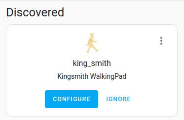
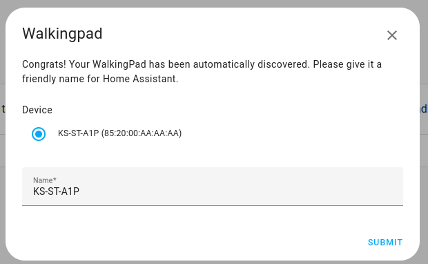
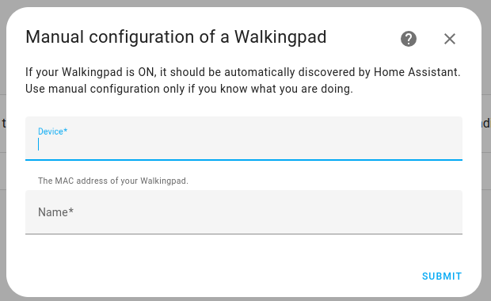

# Walkingpad - Home Assistant custom integration

[![GitHub Release][releases-shield]][releases]
[![GitHub Activity][commits-shield]][commits]
[![License][license-shield]](LICENSE)


**This integration will set up the following platforms.**

Platform | Description
-- | --
`sensor` | WalkingPad usage metrics.
`switch` | Belt control (requires remote control to be enabled).
`number` | Speed control in manual mode (requires remote control to be enabled).

## Installation

### HACS
1. Open the HACS dashboard then click `Integrations`,
1. Click the `3 dots menu` on the top right corner
1. Click `Custom repository`
1. Enter the repo url `https://github.com/madmatah/hass-walkingpad`
1. Chose a the `Integration` category then **Submit**
1. Click on the new `Kingsmith WalkingPad` repo
1. Click on `Download` on the bottom right corner.
1. Restart Home Assistant

### Manual
1. Using the tool of choice open the directory (folder) for your HA configuration (where you find `configuration.yaml`).
1. If you do not have a `custom_components` directory (folder) there, you need to create it.
1. In the `custom_components` directory (folder) create a new folder called `king_smith`.
1. Download _all_ the files from the `custom_components/king_smith/` directory (folder) in this repository.
1. Place the files you downloaded in the new directory (folder) you created.
1. Restart Home Assistant
1. In the HA UI go to "Configuration" -> "Integrations" click "+" and search for "WalkingPad"

## Configuration

To add your WalkingPad device to Home assistant, you must have a bluetooth adapter configured or a bluetooth proxy. This part is documented in the [Bluetooth](https://www.home-assistant.io/integrations/bluetooth/) page of the official Home Assistant documentation.

Before all, ensure that your WalkingPad device is not connected to any device, or it will not be detected.

This custom integration offers 2 configuration modes :

### 1. Automatic bluetooth discovery

Your WalkingPad can be detected automatically by HomeAssistant if its name is recognized by this integration.

In this case, you will see a new discovered device in `Settings > Devices & Services`.



Just click and configure and enter a friendly name for your device:




That's it!

If your device is not detected, read the [FAQ](#my-walkingpad-device-is-not-detected) and try to use the Manual configuration mode.

### 2. Manual configuration

In `Settings > Devices & Services`, click on `Add integration` and look for `KingSmith WalkingPad` brand.

If you click on it, it will open the manual configuration form:




Enter your device MAC address in the "device" field and a friendly name in the "name" field.

See the [FAQ](#my-walkingpad-device-is-not-detected) for more details.

### 3. Remote control

This integration supports remote control of your WalkingPad device, allowing you to start/stop the belt and adjust speed directly from Home Assistant. However, **remote control is disabled by default** for safety reasons, as it can create dangerous situations.

To enable remote control, you can either:
- Activate it during the initial setup (automatic or manual configuration) by expanding the "Remote control" section in the configuration form
- Enable it later by going to `Settings > Devices & Services`, selecting your WalkingPad integration, clicking on the three dots menu, and choosing "Configure"

Once enabled, you need to select a preferred mode that determines how the remote control behaves:

#### Manual mode (default)

When manual mode is selected:
- A **switch entity** is created that directly controls the belt start/stop. Turning the switch on starts the belt, turning it off stops it.
- A **number entity** is created for speed control, allowing you to set the belt speed between 0.5 and 6.0 km/h (in increments of 0.1 km/h). The speed can only be adjusted when the belt is active or starting.

#### Auto mode

When auto mode is selected:
- A **switch entity** is created that controls the WalkingPad mode switching. Turning the switch on switches the device to AUTO mode (the belt will start automatically when motion is detected), turning it off switches it to STANDBY mode.
- No speed control is available in auto mode, as the WalkingPad automatically adjusts the speed based on detected motion.

**Important safety note**: Always ensure the WalkingPad area is clear before using remote control features. Use these features at your own risk.

<!---->

## FAQ

### My WalkingPad device is not detected

First, make sure no other Bluetooth device is connected to your WalkingPad.

If your device is still not automatically detected by Home Assistant, it's
probably due to the fact that its bluetooth name is unknown. In this
case, you can try to add it manually to Home Assistant.

First, launch a LE scan from your host system (or any other device with a
Bluetooth LE scanner application) to get the MAC address of your WalkingPad
device.

For example, to launch a bluetooth LE scan, on linux, you can run:
```
$> sudo hcitool lescan

LE Scan ...
85:AA:BB:CC:DD:FF KS-ST-A1P
85:AA:BB:CC:EE:FF KS-ST-A1P
```

Note the MAC address (`85:AA:BB:CC:DD:FF` in the previous example), then go to
`Home Assistant` > `Settings` > `Devices and Services` > `Add integration` > Search for `Kingsmith Walkingpad`.

It should open the manual configuration form. Enter the MAC address in the
`Device` form field, any the name of your choice in the `Name` field.
Click on `Submit` and cross your fingers!

If it works, please open an issue here and tell me the Bluetooth name of your
WalkingPad and which model it corresponds to. This will enable me to activate
automatic detection for this model.

## FAQ for developers

### How to enable my bluetooth adapter in the devcontainer ?

I've wasted some time on this problem, so here are a few pointers to get a working development environment.
I assume you're running Linux. Sorry, I don't know how to do this for other operating systems.

Everything is documented on the [Home Assistant Bluetooth page](https://www.home-assistant.io/integrations/bluetooth#additional-details-for-container-core-and-supervised-installs), but here is a summary of the
steps to be performed **on your host system**:

#### 1. Install and enable DBus-Broker

See the [official dbus-broker instructions](https://github.com/bus1/dbus-broker/wiki) for more details. On Ubuntu I had to run the following commands:

```
sudo apt install dbus-broker
sudo systemctl enable dbus-broker.service
sudo systemctl --global enable dbus-broker.service

reboot
````

#### 2. Ensure that bluez is installed

You need to have Bluez >= 5.63 installed on your host system.

#### 3. Ensure that your dbus socket is in /run/dbus

It should be OK in most case, but if your DBus socket is not
in `/run/dbus`, you might have to tweak the .devcontainer.json (see `runArgs`).


#### 4. Profit

Then, you can run the devcontainer and start Home Assistant with `scripts/develop`.

You might have a TLS error on the first run in the logs. Just restart the command and everything should be fine, your bluetooth adapter should be detected by Home Assistant.


## Acknowledgements

This project uses [ph4-walkingpad](https://github.com/ph4r05/ph4-walkingpad) library to control the WalkingPad device. Thanks [@ph4r05](https://github.com/ph4r05)!

This project takes inspiration and code from [@indiefan](https://github.com/indiefan)'s [king smith](https://github.com/indiefan/king_smith) custom integration.

***

[commits-shield]: https://img.shields.io/github/commit-activity/y/madmatah/hass-walkingpad.svg?style=for-the-badge
[commits]: https://github.com/madmatah/hass-walkingpad/commits/main
[license-shield]: https://img.shields.io/github/license/madmatah/hass-walkingpad.svg?style=for-the-badge
[releases-shield]: https://img.shields.io/github/release/madmatah/hass-walkingpad.svg?style=for-the-badge
[releases]: https://github.com/madmatah/hass-walkingpad/releases
